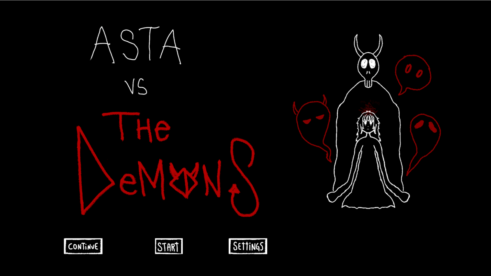
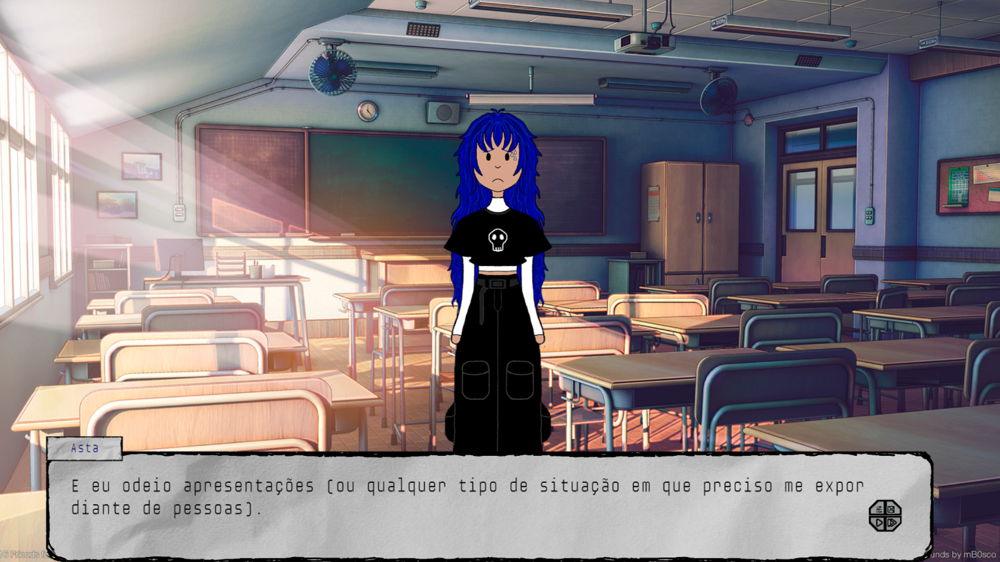
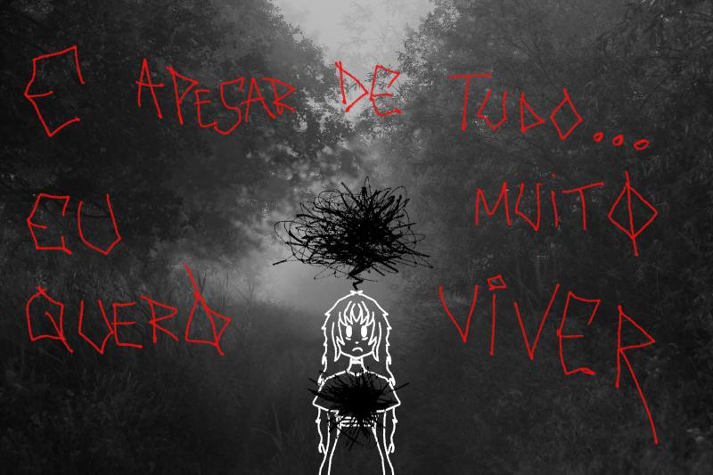
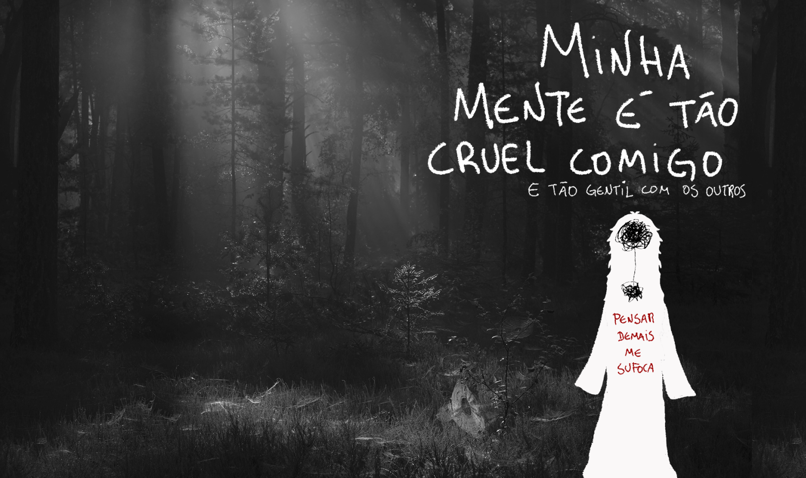

# Asta vs The Demons

Web platform aimed at raising awareness about mental disorders through a Visual Novel.

  

  

## Overview

In 2019, approximately 1 billion people worldwide had some form of psychological disorder, with 14% of that total being adolescents.

In the field of technology—specifically in game development—studies have been conducted since 2005 on the positive impact that games can have on users, revealing significant potential in combating mental disorders.

  

## Project Goal

Based on this, the goal of creating the web platform **"Asta vs The Demons"** emerged, along with the integration of a game into the application, in order to provide Visual Novel players with an immersive experience of empathy and identification. This is achieved through the game's protagonist, who addresses the main themes of mental disorders, psychosomatic symptoms, and somatic symptom disorders.

  

## Technologies Used

### Front-end:
- **HTML** (HyperText Markup Language)
- **CSS** (Cascading Style Sheets)
- **JavaScript**
- **TailwindCSS**
- **RenJS** (for game creation)

### Back-end:
- **Node.JS** (integrated with the Express framework)
- **PostgreSQL** (database management)

## Publication and Results

The application was published on the [itch.io platform](https://itch.io) (which promotes indie games and independent developers), along with a user experience survey regarding the platform and the game, to support the academic purposes of the project. The survey received over 40 responses, revealing the meaningful impact of the user experience with this project.

  

## Conclusion

Based on the research conducted, it is concluded that the game has a promising purpose, being capable of delicately addressing topics that involve the complexity and obscurity of the human mind. This brings more awareness and identification to players, which are essential factors in the processes of treating mental disorders.

  

